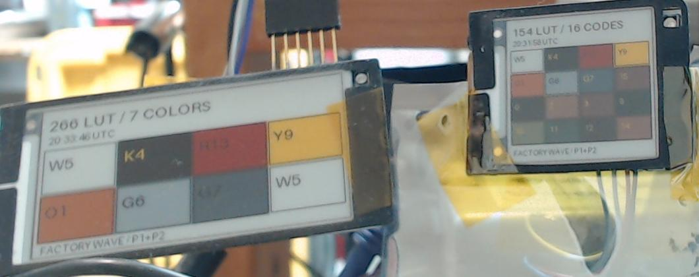
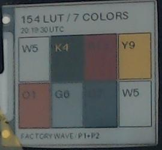
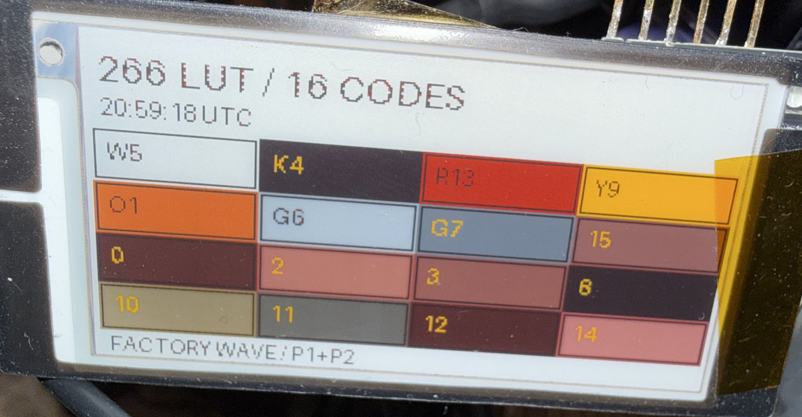
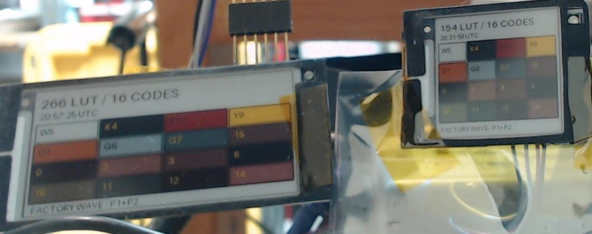

# Beyond four colors: orange and gray on Nebular Pro Q-N panels

Bench findings, 4 October 2026 — Gerard780.

**The tested Nebular Pro-154Q-N and Pro-266Q-N panels displayed seven visible
palette states: white, black, red, yellow, orange/coral, light gray and dark
gray.** Separate diagnostic builds exposed three additional codes already
present in the recovered factory palette. These tests used each panel's own
factory LUTs; waveform timing and analog voltage settings were unchanged.

The [unified v2 release](../README.md#download) continues to accept four-color
images. This finding establishes additional panel states in diagnostic charts,
not general seven-color image support in the released firmware or OEPL AP.



*Left: Pro-266Q-N seven-color chart. Right: Pro-154Q-N sixteen-code chart.
The O1 swatch shows orange/coral. G6 and G7 are the additional gray states.*

## What started the experiment

During the initial Pro-266Q-N driver work on 28 September, an incomplete
single-pass diagnostic settled into dark red, orange, yellow and white.
A subsequent second-component test showed dark gray, black, gray and white.
Those observations suggested that the panel could produce more than the four
colors exposed by the ordinary image path.

Later decoding recovered a seven-entry factory palette. On 4 October, new
diagnostics sent those exact palette codes through the complete two-component
refresh sequence. The settled charts showed the additional states on both
connected bench specimens. The owner also confirmed the 1.54-inch orange/coral
swatch by eye.

## Palette codes and physical results

| Observed state | Factory code | First component: upper two bits | Second component: lower two bits |
| --- | --- | --- | --- |
| White | `0x5` | `1` | `1` |
| Black | `0x4` | `1` | `0` |
| Red | `0xD` | `3` | `1` |
| Yellow | `0x9` | `2` | `1` |
| Orange/coral | `0x1` | `0` | `1` |
| Light gray | `0x6` | `1` | `2` |
| Dark gray | `0x7` | `1` | `3` |

Orange/coral is lighter than the red reference and visibly warmer. Its
appearance should not be described as a measured match to a particular RGB
value or as a guaranteed bright, saturated orange. Dark gray is much closer
to black than light gray is; the tests did not measure color accuracy or
minimum distinguishable contrast.



*The 1.54-inch chart repeats white in the lower-right cell as a reference.*

## How the diagnostic exposes the extra states

The ordinary adapter translates its source image planes into just four
factory codes: `5`, `4`, `13` and `9`. The panel layer already accepts the
additional factory codes `1`, `6` and `7`.

Each intermediate four-bit factory code is split into two transmitted
components:

```text
component 1 = (factory_code >> 2) & 3
component 2 = factory_code & 3
```

Four component pixels are packed into one byte, in bits 7–6, 5–4, 3–2 and
1–0. Each component runs its own initialization, image transfer and refresh
with the corresponding factory waveform. The existing driver streams its
535-byte waveform/analog record through command `0x20` and the packed image
through command `0x10`.

The [developer handoff](../atc-review/README.md) includes the actual
[factory waveform fixtures](../atc-review/fixtures/),
[record hashes and metadata](../atc-review/waveforms.json), and
[comparison between sizes](../atc-review/waveform-comparison.json). Each
fixture contains 546 bytes; the driver sends the first 535 bytes, comprising
the seven-byte analog header and 528 waveform bytes. It selects one of ten
temperature bands with inclusive upper limits of 3, 6, 9, 12, 15, 20, 25, 30,
35 and 127°C, using the signed MCU temperature at image start. Each band has
a separate first/second-component pair for each panel size.

For these experiments, the diagnostic substituted palette codes in fixed
chart cells while retaining uploaded labels and borders. It preserved the
model-specific factory waveform selection, booster settings and refresh
sequence. Simply adding orange to an AP JSON color table would not supply
the extra information required by the firmware's current image decoder.

The first chart's color cells were misaligned with its labels. The uploader's
90-degree source rotation and the adapter's native row reversal together
transpose the displayed coordinates. The corrected charts account for that
mapping; the misaligned first chart is excluded from the conclusions here.

## Hardware and validation scope

| Test | Pro-154Q-N | Pro-266Q-N |
| --- | --- | --- |
| Specimen | C3HW2, PCB HSEL4Q_01_54M_39 | Previously tested legacy-product-record bench specimen |
| Native resolution | 200 × 200 | 152 × 296 |
| Chart orientation | 200 × 200 | 296 × 152 landscape |
| Programmer | RP2040 bench programmer | CH340 |
| MCU / EPD temperature for seven-color test | 29°C / 29°C | 24°C / 26°C |
| Factory band selected from MCU temperature | Band 7: 25 < T ≤ 30°C | Band 6: 20 < T ≤ 25°C |
| Physical evidence | Settled chart and owner observation | Settled chart photograph |
| Diagnostic installation readback | Application and changed sectors verified | Final recovery programming completed without bulk readback |

The 154 and 266 waveforms differ. This experiment did not interchange them.
Other revisions, the newer factory-record 266 path, and operation outside
these ambient conditions have not been physically validated for the extra
colors.

Host tests exercised each seven-color diagnostic over all ten factory bands
and both existing raw input formats. They checked every chart pixel in both
components, all twenty model-specific waveform streams against the captured
bytes, rejection of the other model, and BUSY timeout/power shutdown.
Installation transaction tests also checked rollback after simulated partial
sector writes. These software checks do not establish physical temperature
coverage.

The initial 266 installation lost its SWS connection, and automatic rollback
could not complete. Re-establishing the link allowed all seven changed
application sectors to be rewritten, with the application entry sector last.
At the owner's request, that recovery skipped bulk readback. Flash protection
was restored; the tag booted, accepted the chart and visibly refreshed.
Those observations validate the display experiment without claiming a
byte-for-byte readback of that final diagnostic application.

## Testing all sixteen component combinations

Both the 1.54-inch and connected legacy-record 2.66-inch panels also received
every four-bit combination, including codes absent from the seven-entry factory
palette. Their separate diagnostics tested this order:

```text
 5   4  13   9
 1   6   7  15
 0   2   3   8
10  11  12  14
```

The 1.54-inch matrix transfers at a measured MCU temperature of 28°C produced
additional dark neutral and warm tones. The 2.66-inch follow-up used its own
factory band 6 at MCU temperature 24°C (EPD reading 25°C). It also produced
muted red/brown and dark neutral tones beyond the seven factory palette codes.
A second 2.66 transfer at MCU/EPD temperature 24°C/24°C produced a broadly
consistent chart. Both webcam photographs were captured about 49 seconds after
transfer completion. A clearer owner-supplied photograph of that second chart
shows strong orange at code 1, pink/salmon shades at codes 2 and 14, mauve at
code 15, a khaki tone at code 10, and an additional neutral gray at code 11.
These names describe appearance in the photograph, not calibrated colors.
Some dark combinations and warm shades still look close. **This does not
establish sixteen distinct, repeatable usable colors.** Longer persistence
tests, controlled lighting, previous-image comparisons and temperature testing
are still needed to assess those additional combinations.



*Owner-supplied photograph of the second 2.66 chart (display timestamp
20:59:18 UTC). This is the existing rectangular crop of the
[original owner photograph](../atc-review/images/266-16-codes-original.jpg),
with no resizing or color adjustment. [Photo provenance](../atc-review/images/266-16-codes-provenance.json)
records the original hash and crop rectangle. Camera settings and capture
time were not supplied. The orange and additional pink, mauve and khaki shades are
clearer here than in the webcam images.*



*Left: the 2.66-inch sixteen-code follow-up. Right: the earlier 1.54-inch
sixteen-code chart. The row order is the same on both panels. This is a crop
of the [original camera capture](images/lut-colors/both-panels-16-codes-original.jpg).
The 2.66 diagnostic installation restored flash protection and booted after
programming; bulk readback was omitted at the owner's request.*

## OEPL support for more than four colors

OEPL already defines `DATATYPE_IMG_RAW_3BPP` (`0x22`) for ACeP and
`DATATYPE_IMG_RAW_4BPP` (`0x23`) for Spectra. Its AP image converter packs
3-bit and 4-bit palette indices and selects colors from the tag profile's
color table. See the upstream [protocol definitions](https://github.com/OpenEPaperLink/OpenEPaperLink/blob/master/oepl-definitions.h)
and [image converter](https://github.com/OpenEPaperLink/OpenEPaperLink/blob/master/ESP32_AP-Flasher/src/makeimage.cpp).
Three bits can encode eight entries; four bits can encode sixteen. The
encoding capacity does not establish that a particular panel renders that
many distinct physical colors.

The current Nebular unified v2 adapter accepts only RAW1/RAW2 (`0x20`/`0x21`)
and maps their source planes to four factory codes. Adding more colors requires
extending the tag's receiver and decoder, setting a matching AP profile palette
and bit depth, and mapping each incoming palette index to the appropriate
factory code. Image-slot capacity, caching, orientation and transfer behavior
need validation with the larger images. BLE upload tools also need a matching
encoder if that upload route is to support the extra colors.

A practical implementation could reuse OEPL's existing 4-bit format, initially
exposing the seven factory colors and retaining the other component codes for
experiments. The uncompressed pixel payload would be 20,000 bytes for the
200 × 200 panel and 22,496 bytes for the 152 × 296 panel, twice the current
two-plane four-color payload. Existing RAW1/RAW2 support should remain available.

This is a proposed extension, not an implemented feature of this release.
The AP already has the packing machinery; extending the patched ATC tag
application is the larger implementation uncertainty. The demonstrated panel
refresh path can retain each model's factory LUTs and analog settings.

## Photographs and next steps

The opening image is a crop of the [original brighter camera capture](images/lut-colors/both-panels-original.jpg).
The webcam exposed no flash control, so exposure and gain were increased.
Contrast and saturation were unchanged, no digital color correction was
applied, and the previous camera settings were restored. The photographs are
visual evidence, not calibrated measurements of the panel's gamut.

The separate chart diagnostics were left installed on the two bench tags at
the owner's request. They recolor fixed areas of incoming images and are not
general seven-color firmware. They are not included in the unified v2 download.

To make arbitrary seven-color images usable through OEPL, the next work is to
add tag-side support for an existing higher-bit-depth image format, configure
the matching AP palette, and test transitions, ghosting, repeatability and
temperature behavior.
The confirmed starting point is that both tested panels can visibly render
the seven factory palette states using their existing LUTs.

[Repository README](../README.md) · [Released firmware validation](VALIDATION.md) · [Credits](CREDITS.md)
